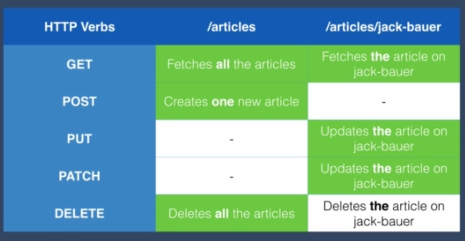

# Angela Yu Web Development Course - Simon Game Javascript Challenge solution

This is a solution to the [REST API exercise chapter by Angela Yu](https://www.udemy.com/course/the-complete-web-development-bootcamp). 

## Table of contents

- [Overview](#overview)
  - [The challenge](#the-challenge)
  - [Screenshot](#screenshot)
  - [Links](#links)
- [My process](#my-process)
  - [Built with](#built-with)
  - [What I learned](#what-i-learned)
  - [Continued development](#continued-development)
  - [Useful resources](#useful-resources)
- [Author](#author)

## Overview

### The challenge

Database should be able to:
- Serve up data to the client while following typical REST architecture
- - This includes: GET, POST, PUT, PATCH, and DELETE functions for each route and sub-route.

### Screenshot



### Links

- Solution URL: [https://github.com/wilso663/example-rest-api](https://github.com/wilso663/example-rest-api)

## My process

### Built with

- Node.js, Mongo DB, Mongoose, Express

### What I learned

The most helpful thing that I learned was being able to extract a url subroute as a variable with body-parser as well as creating a subroute with express using the :articleName as a parameter ID for the subroute.
This really simplified the logic of getting the url to match with its corresponding title for Mongoose findOne query.
```javascript
app.route("/articles/:articleName").get(function(req,res){ //Fetch One article
  const articleName = req.params.articleName;
  Article.findOne({title: articleName}, function(err, foundArticle){
    if(!err){
      res.send(foundArticle);
    } else {
      res.send(err);
    }
  });
})
```

### Continued development

As this is a small project intended as an exercise, additional development is entirely up to adding new features. Since the mobile and desktop layouts look and function as intended, this release is intended to be final.
This kind of API could be adapated to future projects, but it's intended to be an example of how to implement an REST API for future reference, so I'll keep this repo small and easy to understand.

### Useful resources

- [Mongoose Web Docs](https://mongoosejs.com/docs/api/) - The official documentation for Mongoose development was paramount in referencing all the functionality used in our driver to serve up the Mongo DB data to the app
- [Express Web Docs](http://expressjs.com/en/api.html#req.params) - The official documentation for Express that I referenced often for syntax in implementing the local server.

## Author

- Website - [Stephen Wilson](https://github.com/wilso663)
- Frontend Mentor - [@wilso663](https://www.frontendmentor.io/profile/wilso663)